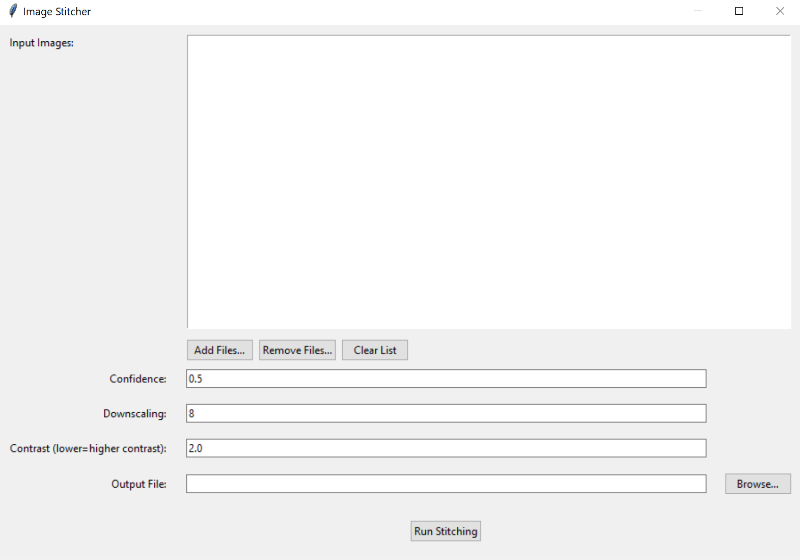

# EM Preview

Preview EM images by stitching them and adjusting contrast. Designed as a tool for the Electron Microscopy Core at the Max Planck Florida Institute for Neuroscience.

---

## Installation

Head to the [releases page](https://github.com/AlexanderJCS/em-preview/releases/latest) and download `gui.exe`. Then run it.

## Usage

1. Click "add files" and add all the images files to process. dm3, png, jpg, tiff, and bmp images are supported.
2. Select the downscaling parameter. This reduces your image by a factor of 8x, by default. Reducing downscaling will take longer but will produce a higher resolution output image.
3. Select "browse" to choose the output file location. Options are: jpg, tiff
4. Click "Run Stitching"

### Other Parameters

**Confidence:** only reduce this parameter if the software is having trouble stitching all images.
**Contrast:** adjust the contrast of the output image. Lower values give higher contrast. Only adjust this parameter if the output image contrast is not satisfactory or the software has trouble stitching the images without error.
